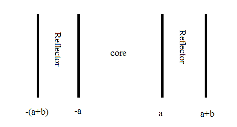
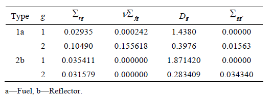

# INTRODUCTION
This is a simple MatLAB script solving the two-group neutron diffusion equation numerically to obtain flux and multiplication factor (****k*). The scenario in question is as below:

*For two group reflected slab reactor shown in the following figure, determine the thermal and fast flux and effective multiplication factor.*

*Nuclear parameters for reflected slab reactor are given as:*

